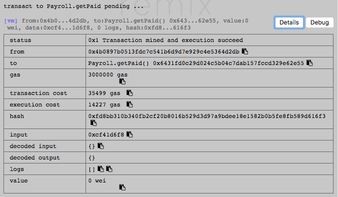

### 第一题、函数调用截图

##### 1）添加余额


##### 2）添加雇员


##### 3）更新雇员


##### 4）移除雇员


##### 5）工资可用次数


##### 6）获取工资



##### 7）所有者


##### 8）雇员信息获取


##### 9）转移所有者


## 第二题、更改员工薪水支付地址

```javascript
/**
 * 更新员工收取工资地址
 */
function changePaymentAddress(address _oldAddr, address _newAddr) 
								public onlyOwner employeeExist(_oldAddr) {

      var employee 					= employees[_oldAddr];
      employees[_newAddr].addr 		= _newAddr;
      employees[_newAddr].salary 		= employee.salary;
      employees[_newAddr].lastPayDay 	= employee.lastPayDay;
      delete employees[_oldAddr];
    }
```


## 第三题、学习C3 Linearization，求继承线

> 最终继承线为：[Z, K1, K2, A, B, C, O]

解答步骤：

```
L(O) := O

L(A) := [A] + merge(L(O), [O])
	  = [A] + merge([O], [O])
	  = [A, O]
		
L(B) := [B] + merge(L(O), [O])
      = [B] + merge([O], [O])
      = [B, O]
      
L(C) := [C] + merge(L(O), [O])
      = [C] + merge([O], [O])
      = [C, O]
      
L(K1) := [K1] + merge(L(A), L(B), [A, B])
	   = [K1] + merge([A, O], [B, 0], [A, B])
	   = [K1, A] + merge([O], [B, O], [B])
	   = [K1, A, B] + merge([O], [O])
	   = [K1, A, B, O]

L(K2) := [K2] + merge(L(A), L(C), [A, C])
	   = [K2] + merge([A, O], [C, 0], [A, C])
	   = [K2, A] + merge([O], [C, O], [C])
	   = [K2, A, C] + merge([O], [O])
	   = [K2, A, C, O]

L(Z) := [Z] + merge(L[K1], L[K2], [K1, K2])
      = [Z] + merge([K1, A, B, O], [K2, A, C, O], [K1, K2])
      = [Z, K1] + merge([A, B, O], [K2, A, C, O], [K2])
      = [Z, K1, K2] + merge([A, B, O], [A, C, O])
      = [Z, K1, K2, A] + merge([B, O], [C, O])
      = [Z, K1, K2, A, B] + merge([O], [C, O])
      = [Z, K1, K2, A, B, C] + merge([O], [O])
      = [Z, K1, K2, A, B, C, O]
```

